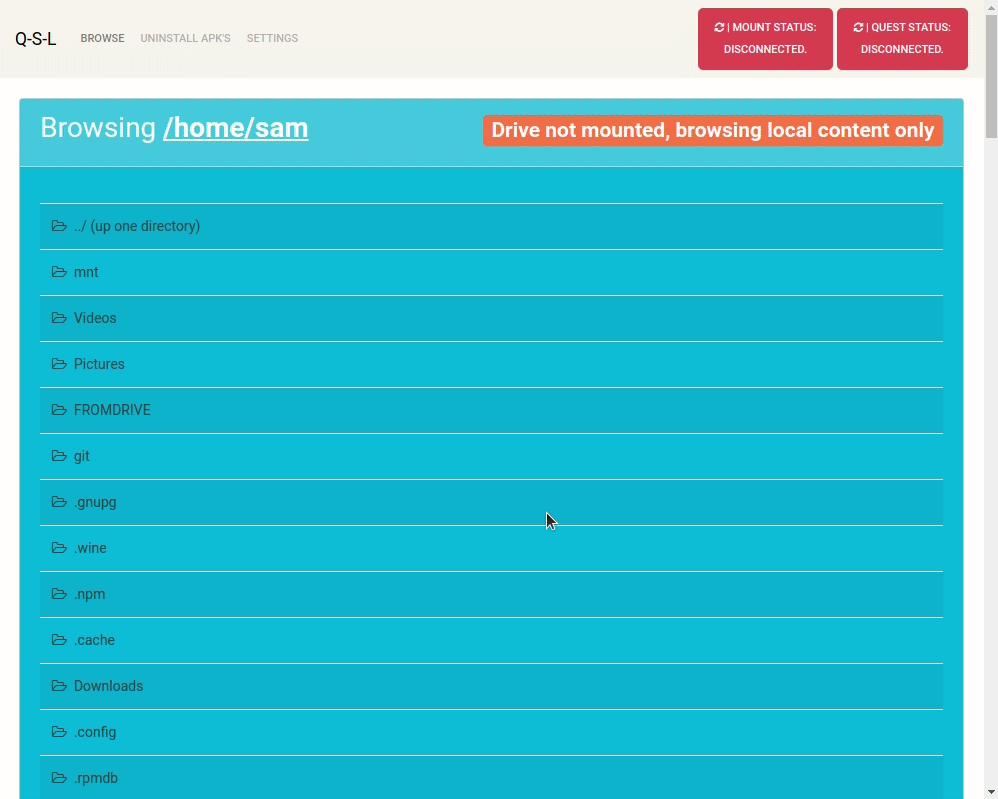

**SideNoder** - A **cross platform sideloader** for Quest(1&2) standalone vr headset.

<details>
<summary>
What makes sidenoder better than other sideloaders ?
</summary>
  


---
  
- **Automatically scan** hmd and drive, to **find available updates**.
- Apps automatically **update without losing app/cache/save data**.
- Apps can update **across mismatching apk signatures**.
- Drive list indicates **availability of working multiplayer functionality**.
- Drive list is **sorted** by date and offers **search function**.
- Drive list offers **pictures and versionCodes**.
- Much much more.

---


</details>


<!-- TABLE OF CONTENTS 
<details open="open">
  <summary>Table of Contents</summary>
  <ol>
    <li>
      <a href="#about-the-project">About The Project</a>
      <ul>
        <li><a href="#built-with">Built With</a></li>
      </ul>
    </li>
    <li>
      <a href="#getting-started">Getting Started</a>
      <ul>
        <li><a href="#prerequisites">Prerequisites</a></li>
        <li><a href="#installation">Installation</a></li>
      </ul>
    </li>
    <li><a href="#usage">Usage</a></li>
    <li><a href="#roadmap">Roadmap</a></li>
    <li><a href="#contributing">Contributing</a></li>
    <li><a href="#license">License</a></li>
    <li><a href="#contact">Contact</a></li>
    <li><a href="#acknowledgements">Acknowledgements</a></li>
  </ol>
</details>
-->

<!-- TABLE OF CONTENTS -->
<details open="open">
  <summary>How to install or run this app</summary>

  <ul>
    <li><a href="#run-precompiled-release-on-windows">Windows</a></li>
    <li><a href="#run-precompiled-release-on-linux">Linux</a></li>
    <li><a href="#run-precompiled-release-on-mac">Mac/OSx</a></li>
  </ul>

</details>


<details>
  <summary>How to download and manually run this app using node instead</summary>

  <ul>
    <li><a href="#manually-run-using-node-on-windows">Windows</a></li>
    <li><a href="#manually-run-using-node-on-linux">Linux</a></li>
    <li><a href="#manually-run-using-node-on-mac">Mac/OSx</a></li>
  </ul>

</details>


<!--

-->


## Running the compiled version

#### Run precompiled release on windows:
1. Download and unpack the latest windows release from `https://github.com/whitewhidow/quest-sidenoder/releases/latest`
2. Run the `windows-install.bat` script and follow the onscreen instructions (this will install 7ZIP, GIT, NODE, ADB, RCLONE and WINFSP) 
3. Run the `sidenoder.exe` application


#### Run precompiled release on linux:
1. Install ADB and RCLONE: `sudo apt install adb && curl https://rclone.org/install.sh | sudo bash`
2. Download and unpack the latest linux AppImage from `https://github.com/whitewhidow/quest-sidenoder/releases/latest`
3. Make the AppImage executable.
4. Run the AppImage


#### Run precompiled release on mac:

1. Install ADB, RCLONE and OSXFUSE:
```
/bin/bash -c "$(curl -fsSL https://raw.githubusercontent.com/Homebrew/install/HEAD/install.sh)"
brew install android-platform-tools
curl https://rclone.org/install.sh | sudo bash
brew install osxfuse
```
2. Download and unpack the latest mac release (.App / .dmg) from `https://github.com/whitewhidow/quest-sidenoder/releases/latest`
3. Run the .App or .dmg

<details>
<summary>Running big sur?</summary>
For mounting issues with Sidenoder on Osx Big Sur, Please install the latest osxfuse (prerelease)
https://github.com/osxfuse/osxfuse/releases
</details>


Please report any issues here :

https://github.com/whitewhidow/quest-sidenoder/issues | https://t.me/whitewhidow | https://discord.gg/pVMsAyYhAf

---
---
---
---
---
---

## Alternatively, Manually run using node
#### Manually run using node on windows:
1. Download and install GIT from `https://git-scm.com/download/win`
2. Run the following in a command line terminal (cmd):
    ```
    git clone https://github.com/whitewhidow/quest-sidenoder.git
    cd quest-sidenoder/
    windows-install.bat
    npm install
    ```
3. Reboot and launch the app from the command line terminal:
    ```
    cd C:\wherever\you\installed\quest-sidenoder
    npm start
    ```


#### Manually run using node on linux:
```
sudo apt install git adb nodejs
curl https://rclone.org/install.sh | sudo bash
git clone https://github.com/whitewhidow/quest-sidenoder.git
cd quest-sidenoder/
npm install
npm start
```

#### Manually run using node on mac:
```
/bin/bash -c "$(curl -fsSL https://raw.githubusercontent.com/Homebrew/install/HEAD/install.sh)"
brew install git
brew install node
curl https://rclone.org/install.sh | sudo bash
brew cask install android-platform-tools
brew cask install osxfuse
git clone https://github.com/whitewhidow/quest-sidenoder.git
cd quest-sidenoder/
npm install
npm start
```
<details>
<summary>Running big sur?</summary>
For mounting issues with Sidenoder on Osx Big Sur, Please install the latest osxfuse (prerelease) from `https://github.com/osxfuse/osxfuse/releases`
</details>
Please report any issues here :

https://github.com/whitewhidow/quest-sidenoder/issues | https://t.me/whitewhidow | https://discord.gg/pVMsAyYhAf
